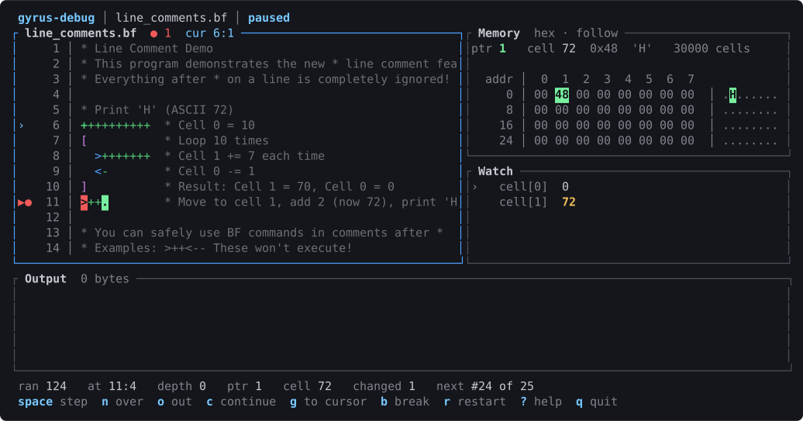

# gyrus

[](https://github.com/avalonalex/gyrus/actions/workflows/ci.yml)

**Production-grade tooling for BrainFuck — interpreter, optimizer, and
Cranelift JIT in Rust.**

When a bracket does not close, you get the line and the column, not a program
that quietly does the wrong thing forever — and you get *every* unbalanced
bracket in one pass, not the first one. When something is slow, `--trace` shows
you which loop is burning 99% of your runtime. When arithmetic leaves the
range you expected, `--cell-model checked` halts and reports that cell 0
overflowed at line 412, column 7, instead of rolling to zero and poisoning
everything downstream. A runaway program dies on a step limit or a wall-clock
timeout rather than hanging the pipeline behind it. Memory is bounds-checked or
grows on demand, and the three semantic knobs — memory model, cell model, EOF
behaviour — are fully independent, so you can match whatever dialect your
program was written against instead of arguing with the interpreter.

A *gyrus* is a fold of the cerebral cortex. The word also reads as *gyre* — a
loop, a spiral.

> **Note**: written with AI assistance (Claude), as a project for learning how
> interpreters, optimizers, and debuggers fit together. Built in earnest, which
> is not the same as battle-tested.

## What a real error message looks like

Most implementations say nothing when your brackets do not balance. The
program runs, does the wrong thing, and you work backwards from the output.

Here is what gyrus says instead — with syntax highlighting, in a real
terminal:

```
$ gyrus programs/errors/unmatched_bracket.bf
Error: Unmatched '[' at line 12, column 1
   10 | >+          * Move and increment
   11 |
   12 | [>+++       * Opening bracket without matching close
      | ^
   13 |             * This will cause a parse error
```

Every bracket error is reported in one pass, not one per run. Runtime errors
carry the same context under `--debug`: the parser
keeps a source location for every single instruction, so "cell overflow at
instruction 5042" becomes a line, a column, and a caret.

## And a debugger to watch the tape in

`gyrus-debug` stops a program one instruction at a time with the source, the
tape, the output, and any cells you are watching on screen together. Here it is
paused on a breakpoint, three instructions from printing:



Breakpoints are characters rather than lines, because a BrainFuck program is
often one line of a hundred instructions — and a `@` in the source is one too,
which is how a breakpoint survives being committed. `w` watches a cell, or takes
`out W` to stop when the program is about to print a W: the output is usually
wrong at some character, and that is the character you want the tape for.

There is a [thirteen-lesson tutorial](docs/tutorial.md) built on the same
machinery, which records every step so you can walk *backwards* through a loop.

That image is generated by `scripts/capture-debugger-svg.py`, which drives the
real binary in a pty and renders the bytes it writes — so it cannot quietly
drift from what the program actually draws, and CI fails if it does.

## Quick start

```bash
git clone https://github.com/avalonalex/gyrus.git
cd gyrus
cargo build --release

./target/release/gyrus programs/basic/hello_world.bf     # Hello World!
./target/release/gyrus --verbose programs/basic/hello_world.bf
./target/release/gyrus-tool view programs/basic/simple.bf --line-numbers
./target/release/gyrus-debug programs/basic/hello_world.bf
./target/release/gyrus-tutorial
```

`rust-toolchain.toml` pins the compiler, so `cargo` picks the right one on its
own. Building against another toolchain needs Rust **1.95** or newer — that is
Cranelift's floor, inherited through the JIT. The library on its own needs
1.88, where let-chains stabilized.

## Features

**Execution**
- Four execution modes: an optimized interpreter (default), a Cranelift JIT
  (`--jit`) that compiles the same optimized program to native code, a debug
  interpreter that tracks source locations, and a tracing interpreter
  (`--trace`) that profiles execution and prints a heatmap of hot code
- An optimizer that fuses instruction runs and recognizes clear, scan, and
  multiply loops — Hello World compresses 103 instructions to 45
- Memory models: fixed (bounds-checked) or unbounded (grows to a limit)
- Cell models: `wrapping` (standard BrainFuck) or `checked` (errors on
  overflow, for finding arithmetic bugs) — orthogonal to the memory model
- Configurable EOF behavior: zero, -1, no change, or error
- Execution limits by step count and by wall-clock timeout
- A hook system (`ExecutionHook`) with five hook points, zero cost when unused —
  the debugger, the tutorial and `--trace` are all built on it, and none of them
  needed a change to the library to exist

**Diagnostics**
- Every error *and warning* carries a line, a column, and a
  syntax-highlighted excerpt
- All bracket mismatches reported in a single pass
- Static validation for empty loops, extreme nesting, and inefficient idioms,
  aware of which cell model you are running
- Execution statistics: steps, loop iterations, peak memory, I/O counts

**Tooling** (`gyrus-tool`)
- `minify` — strip comments and whitespace (94.9% on the bundled
  `line_comments.bf`: 514 bytes to 26)
- `validate` — static analysis warnings
- `view` — syntax-highlighted source with line numbers and nesting depth
- `debug-info` — inspect the instruction-to-source mapping
- `optimize` — show what the optimizer did, visually
- `compile` — turn a string into a BrainFuck program that prints it
- `generate` — random program generation for fuzzing

**Terminal interfaces**
- `gyrus-debug` — step through a program with the source, the tape, and the
  output on screen at once
- Breakpoints on individual **characters**, not lines, because a BrainFuck
  program is often one line of a hundred instructions
- Breakpoints you can **commit**: a `@` in the source is one, and it means
  nothing to any other BrainFuck implementation, so a marked program still runs
  everywhere
- Stops on **what the program prints**, not only on where it is —
  `--break-output '\n'` is a question a positional breakpoint cannot ask
- Step over and out of loops, watched cells, queued input, and a restart that
  replays what you typed

- `gyrus-tutorial` — thirteen lessons that teach BrainFuck by running it, with
  every step of your program recorded so you can walk backwards through a loop

**Language**
- All eight commands, arbitrarily nested
- `*` line comments, so programs can be documented without accidental
  instructions

## Documentation

| | |
|---|---|
| [User manual](docs/manual.md) | **Start here.** What to reach for, by what you are trying to do |
| [Usage](docs/usage.md) | Every CLI flag, in full |
| [Errors and diagnostics](docs/errors.md) | What gyrus reports when a program is wrong |
| [Memory, cells, and EOF](docs/execution-models.md) | The three orthogonal execution knobs |
| [Development tools](docs/tooling.md) | `gyrus-tool`: validate, minify, view, inspect |
| [The debugger](docs/debugger.md) | `gyrus-debug`: breakpoints, output watches, and the tape in view |
| [The tutorial](docs/tutorial.md) | `gyrus-tutorial`: thirteen lessons in BrainFuck |
| [Development](docs/development.md) | Building, testing, benchmarking |
| [Architecture](docs/architecture.md) | How the pieces fit together |
| [Performance](docs/performance.md) | How it got fast, what didn't work, and why — with a glossary |
| [Changelog](CHANGELOG.md) | What changed, and why, from 0.1 to now |

## Status

**Working**: the parser with full source locations, four execution modes
(optimized, JIT, debug, tracing), the optimizer, the hook system, static
validation, minification, syntax highlighting, the `gyrus-tool` subcommands,
and two terminal interfaces — the debugger and the tutorial. The JIT is
`gyrus --jit program.bf`: the same bytes and the same errors as the
interpreters, with source locations, three and a half times faster on
mandelbrot -- and slower on programs that finish before it has finished
compiling. See [execution models](docs/execution-models.md#the-jit).

**Planned**: a REPL, an AOT build on the JIT's translator, and a macro
preprocessor. Only the last has a design; it lives in [`PRD/`](PRD/).

## Development

```bash
cargo test --workspace
cargo clippy --workspace --all-targets --all-features -- -D warnings
cargo fmt --all -- --check

scripts/check-msrv.sh                 # builds on the MSRV declared in Cargo.toml
scripts/check-readme-commands.py      # every documented flag really exists
scripts/benchmark.sh                  # time the interpreter, verify its output
```

The last three guard claims that rot quietly. See
[Development](docs/development.md) for the rest.

## References

- [The BrainFuck Programming Language](https://www.muppetlabs.com/~breadbox/bf/) - Comprehensive guide and reference by Brian Raiter

## License

The Rust code in this repository is licensed under the [MIT License](LICENSE).

The BrainFuck programs under `programs/third-party/` were written by other
authors and keep their own licenses — including CC BY-SA 4.0 and, in one case,
the GPL. They are aggregated here as a test and benchmark corpus; the MIT
license above covers the interpreter, not those programs. Per-file attribution
is in [`programs/third-party/CREDITS.md`](programs/third-party/CREDITS.md).

## Contributing

This is a personal learning project, so there is no roadmap to sign up for. Bug
reports and corrections are welcome all the same — particularly if you wrote
one of the programs under `programs/third-party/` and want it credited
differently or removed.
